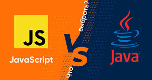
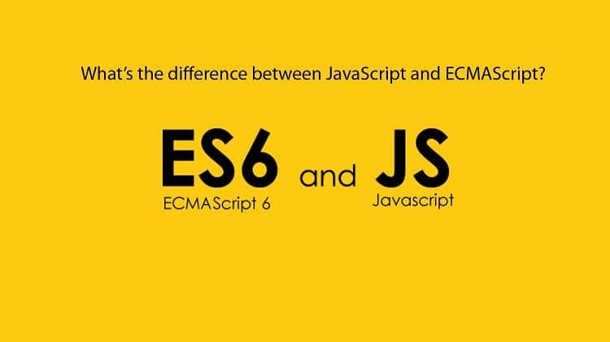
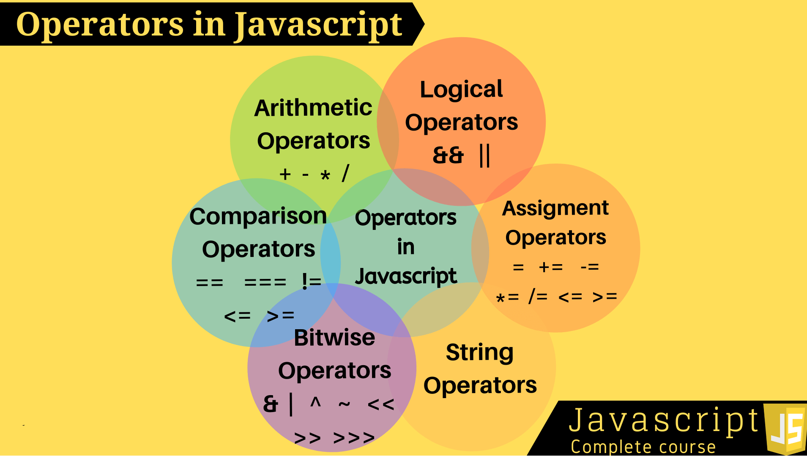

# JS

> ### JavaScript — мультипарадигменный язык программирования. Поддерживает объектно-ориентированный, императивный и функциональный стили. Является реализацией спецификации ECMAScript (стандарт ECMA-262).

> ### Анонсирован этот язык был 18 июля 1996 года. Первым браузером, поддерживающим эту реализацию, был Internet Explorer 3.0. По инициативе компании Netscape была проведена стандартизация языка ассоциацией ECMA.

# About Javascript 

> ### На JavaScript оказали влияние многие языки, при разработке была цель сделать язык похожим на Java. Языком JavaScript не владеет какая-либо компания или организация, что отличает его от ряда языков программирования, используемых в веб-разработке. Название «JavaScript» является зарегистрированным товарным знаком корпорации Oracle в США В 1992 году компания Nombas (впоследствии приобретённая Openwave) начала разработку встраиваемого скриптового языка Cmm (Си-минус-минус), который, по замыслу разработчиков, должен был стать достаточно мощным, чтобы заменить макросы, сохраняя при этом схожесть с Си, чтобы разработчикам не составляло труда изучить его. Главным отличием от Си была работа с памятью.

# Getting started with javascript 
>## JavaScript — популярное программирование язык, обладающий широким спектром Приложения.Ранее JavaScript использовался в основном для сделать веб-страницы интерактивными, например форму валидация, анимация и т. д. В настоящее время JavaScript также используется во многих других областях. например, разработка серверной части, мобильная разработка приложений и так далее.

>### The ECMAScript specification is a standardized specification of a scripting language developed by Brendan Eich of Netscape initially named Mocha, then LiveScript, and finally JavaScript. Learn modern JavaScript from the beginning, but without forgetting the older parts!

>### Типы данных, которые в JavaScript называются примитивными значениями, — это числа, строки, логические значения, значения null и undefined. Такие объекты, как функции и массивы, называются непримитивными значениями. Фундаментальное различие между примитивами и непримитивами заключается в том, что примитивы неизменяемы, а непримитивы изменяемы.

# Operators IN JavaScript

>## Arithmetic Operators
>## Comparison Operators
>## String Operators
>## Logical Operators
>## Bitwise Operators
>## Ternary Operators
>## Type Operators